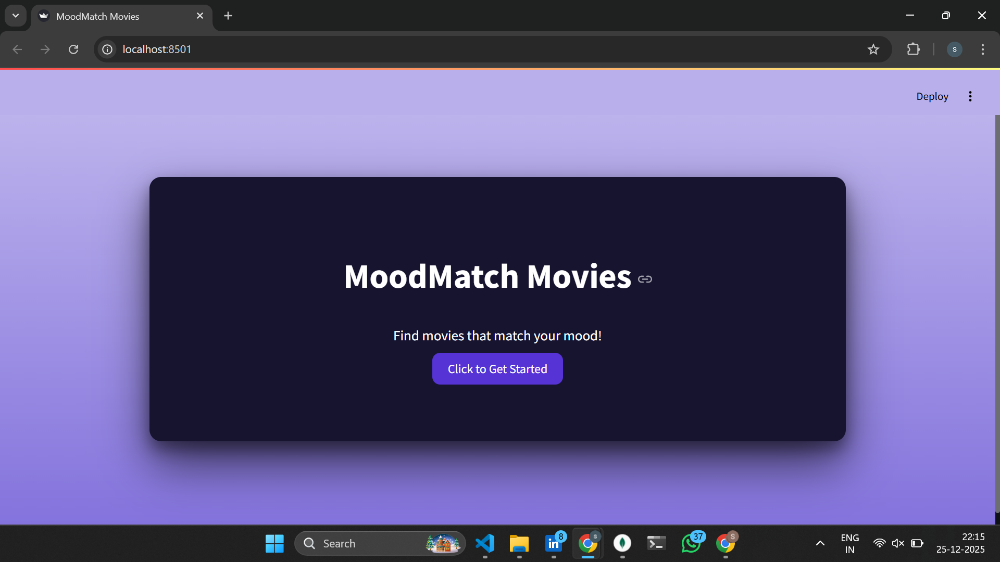
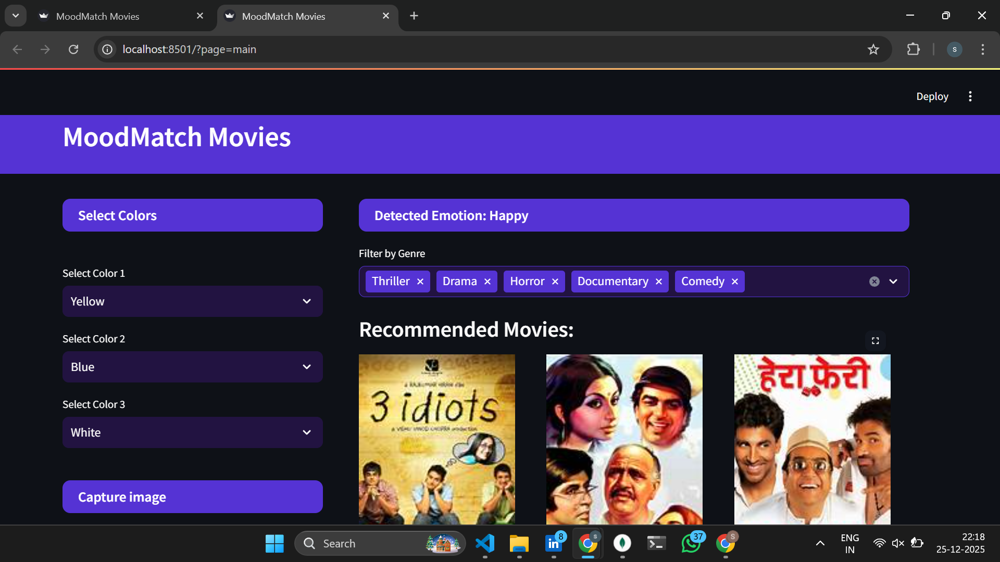
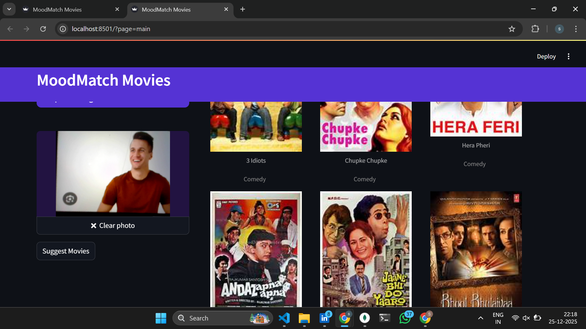
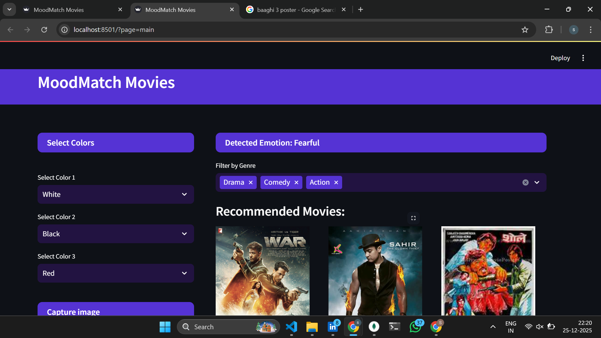

# MoodMatch Movies – Deep Learning-Based Recommendation System  

## Project Summary  
MoodMatch Movies is a Streamlit application that recommends movies based on users' real-time emotions. Using a pretrained CNN model, it captures live webcam input, classifies the user's mood, and suggests movies tailored to that mood.

---

## Overview  
The application leverages computer vision and deep learning to analyze facial expressions in real time. It bridges AI and entertainment by providing mood-based movie recommendations with an intuitive, interactive interface.

---

## Key Features  
Real-Time Emotion Detection: Captures live webcam input and analyzes facial expressions using a pretrained CNN model.  
Mood-Based Movie Recommendations: Suggests personalized movies based on detected emotions (happy, sad, angry, surprised, etc.).  
MongoDB Integration: Stores and manages movie metadata efficiently for quick access.  
Interactive UI: Built with Streamlit for smooth, user-friendly interaction.  
AI-Driven User Experience: Combines emotion recognition with relevant content delivery.  

---

## Technologies Used  
**Framework**: Streamlit  
**AI/ML**: Convolutional Neural Network (pretrained model for emotion detection)  
**Database**: MongoDB (for storing movie metadata)  
**Other Libraries**: OpenCV, NumPy, pandas  

----

## Installation
### 1. Clone the repository:
```
git clone https://github.com/yourusername/moodmatch-movies.git
```
### 2. Navigate into the project directory:
```
cd moodmatch-movies
```
### 3. Create a virtual environment and activate it:
```
python -m venv venv
source venv/bin/activate  # Linux/macOS
venv\Scripts\activate     # Windows
```
### 4. Install dependencies:
```
pip install -r requirements.txt
```
### 5. MongoDB  
Ensure MongoDB is running and your movie metadata database is set up. Update any DB connection strings in support.py.

---

### Usage

1. Run the Streamlit app:
2. streamlit run app.py
3. Allow webcam access when prompted.
4. The app detects your emotion in real time.
5. Browse the recommended movies based on your current mood.

### App Screenshots

#### Home Page


#### Posiitive Emotion Detection & Recommendation



#### Negative Emotion Detection & Recommendation



### AUTHOR
**Sudheeksha Herle V**  
GitHub: *https://github.com/Sudheeksha-Herle-V*  
LinkedIn: *https://linkedin.com/in/sudheeksha-herle-v*